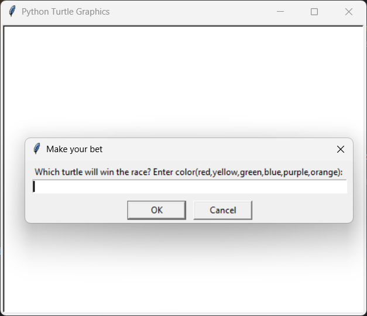
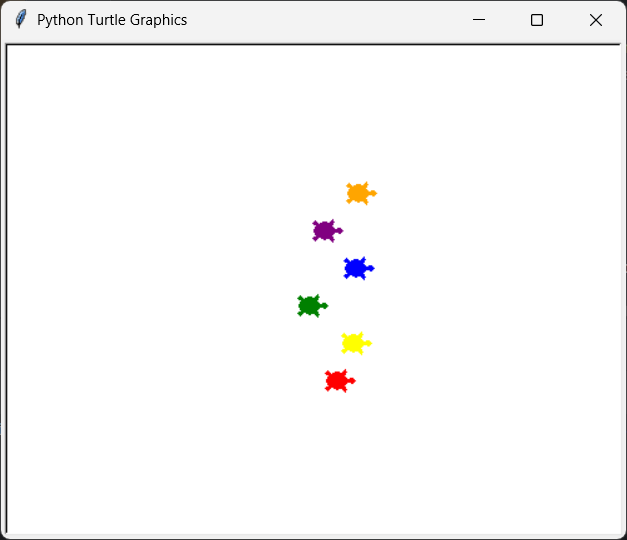

# 🐢 Guess My Shell - Turtle Race

Welcome to **Guess My Shell**, a game made with Python's Turtle module

In this game, six colorful turtles race across the screen — and your job is to **guess which turtle will win** before the race begins! You'll input your guess in a popup window, and the result (win or lose) will be shown in the console.

---

## 🎮 How to Play

1. Run the game:
   ```bash
   python guessmyshell.py
   ```
A popup will ask:

```bash
Which turtle will win the race? Pick a color:
Choose from:

red

yellow

green

purple

blue

orange
```
Watch the race unfold!

Result will be printed to your terminal:

✅ You win! if your chosen turtle wins

❌ You lose! otherwise

🖼️ Screenshots
👇 Game Start Prompt

🐢 The Great Turtle Race!

